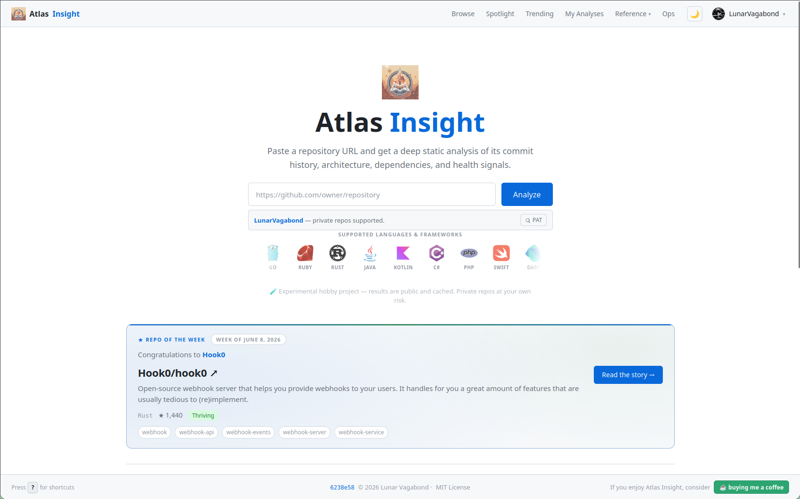
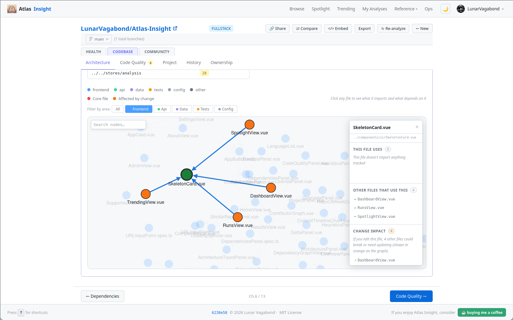
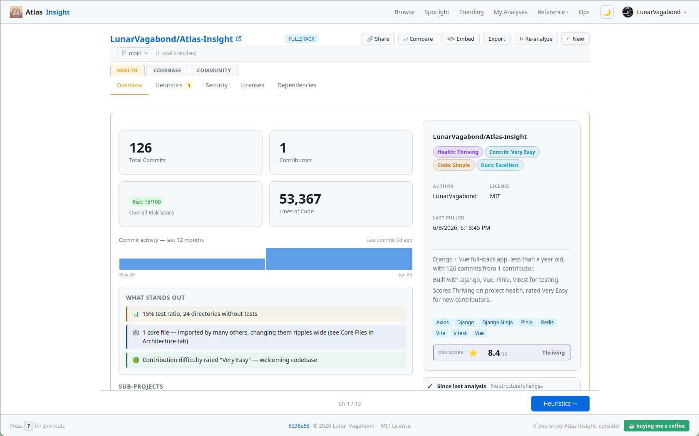
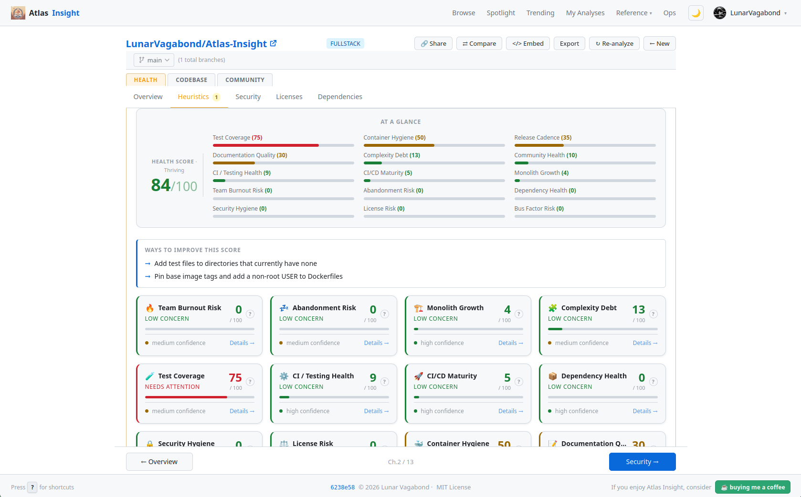

# Atlas Insight

[](https://atlas.dsyndicate.dev/r/LunarVagabond/Atlas-Insight)
[](LICENSE)
[](https://www.python.org/)
[](https://vuejs.org/)
[](https://www.djangoproject.com/)

**Repository archaeology and static analysis platform.**

Paste a GitHub repository URL and get deep architecture insights, commit history analysis, dependency health reports, security findings, OSS readiness scoring, and contributor guidance.

Atlas Insight performs deterministic repository analysis entirely within the application and can optionally generate structured context for use with external AI tools.

> Atlas Insight does **not** send repository contents to AI providers. Optional export features generate structured context that users may manually provide to external AI tools.

Analysis results are archived. Re-running a repository first checks for new commits and reuses existing results when nothing has changed.

---

**Quick Links:** [Features](#features) • [Quick Start](#quick-start) • [API](#api-reference) • [Deployment](#deployment) • [Roadmap](docs/roadmap.md) • [Contributing](#contributing)

---

<table>
  <tr>
    <td></td>
    <td></td>
  </tr>
  <tr>
    <td></td>
    <td></td>
  </tr>
</table>

## Features

| Feature                   | What you get                                                               |
| ------------------------- | -------------------------------------------------------------------------- |
| **Commit analysis**       | Velocity trends, contributor churn, burnout signals, activity decay        |
| **Architecture analysis** | Import graphs, circular dependencies, god modules, hot files               |
| **Dependency health**     | Dependency inventory, lockfile checks, Docker image warnings               |
| **Security scanning**     | Secret detection, `.gitignore` hygiene, repository safety signals          |
| **Heuristic scoring**     | Repository risk and maintenance indicators with mode-aware weighting       |
| **Health score**          | Composite readiness assessment from 0–10 (OSS and closed-source modes)     |
| **Contributing path**     | Actionable contribution opportunities from issues and repository structure |
| **Architecture tours**    | Guided exploration paths through major subsystems                          |
| **Spotlight & Trending**  | Weekly featured repo and community discovery views                         |
| **Health badges**         | Embeddable SVG badges for analyzed repositories                            |

---

## OSS Score

OSS Score is a heuristic assessment of how approachable and maintainable a repository is for open-source contributors.

The score incorporates signals such as:

* Documentation quality
* Contributor friendliness
* Repository activity
* CI/CD maturity
* Dependency health
* Security hygiene
* Project structure
* Contributor distribution and bus factor
* Maintenance indicators
* Open issue management
* Development practices

OSS Score is intended as a directional indicator rather than an objective measure of software quality. A lower score may highlight maintenance or contribution risks rather than deficiencies in the software itself.

---

## Stack

| Layer       | Technology                        |
| ----------- | --------------------------------- |
| Backend API | Django 5 + Django Ninja           |
| Task Queue  | Celery + Redis                    |
| Database    | PostgreSQL 17                     |
| Frontend    | Vue 3 + TypeScript + Vite + Pinia |

**Default Ports**

| Service         | Port |
| --------------- | ---- |
| Django API      | 4500 |
| Vite Dev Server | 4501 |
| Redis           | 4502 |
| PostgreSQL      | 4503 |
| Flower          | 4504 |

---

## Quick Start

```bash
cp backend/.env.example backend/.env

# Optional but recommended:
# Add a GITHUB_TOKEN for higher GitHub API rate limits

make setup
docker compose up -d

make -C backend migrate
make start
```

### Local Services

| Service      | URL                            |
| ------------ | ------------------------------ |
| Frontend     | http://localhost:4501          |
| API          | http://localhost:4500          |
| OpenAPI Docs | http://localhost:4500/api/docs |
| Flower       | http://localhost:4504          |

---

## Development

### Process Management

```bash
make start
make stop
make restart
make status
make logs
```

### Backend

```bash
cd backend

# Run management commands
DJANGO_SETTINGS_MODULE=config.settings.development .venv/bin/python manage.py <command>

# Run tests
DJANGO_SETTINGS_MODULE=config.settings.development .venv/bin/pytest

# Run a specific test file
DJANGO_SETTINGS_MODULE=config.settings.development .venv/bin/pytest apps/repositories/tests/test_models.py

# Linting
.venv/bin/ruff check .

# Formatting
.venv/bin/black .
```

### Frontend

```bash
cd frontend

# Type checking
node_modules/.bin/vue-tsc --noEmit

# Unit tests
npm test

# Production build
make build
```

### All-in-one (from repo root)

```bash
make test        # backend pytest + frontend vitest
make lint        # ruff + vue-tsc
make type-check  # vue-tsc only
```

---

## API Reference

Interactive OpenAPI documentation is available at:

```text
/api/docs
```

when the application is running.

### Core Endpoints

| Method | Endpoint                                        | Description                          |
| ------ | ----------------------------------------------- | ------------------------------------ |
| POST   | `/api/v1/repositories/analyze`                  | Submit a repository for analysis     |
| GET    | `/api/v1/repositories/runs/{id}`                | Retrieve analysis status and results |
| GET    | `/api/v1/repositories/badge/{owner}/{name}.svg` | Generate repository health badge     |

### Just-In-Time Endpoints

These endpoints retrieve live data and cache responses in Redis for 15 minutes unless otherwise noted.

| Method | Endpoint                                                  | Description                   |
| ------ | --------------------------------------------------------- | ----------------------------- |
| GET    | `/api/v1/repositories/runs/{id}/issues`                   | Live GitHub issues            |
| GET    | `/api/v1/repositories/runs/{id}/prs`                      | Open pull requests            |
| GET    | `/api/v1/repositories/runs/{id}/diff`                     | Delta from previous analysis  |
| GET    | `/api/v1/repositories/runs/{id}/file-history?path=<path>` | Recent file history           |
| GET    | `/api/v1/repositories/runs/{id}/similar`                  | Similar repository profiles   |
| GET    | `/api/v1/repositories/runs/{id}/vulnerabilities`          | Dependency vulnerability data |
| GET    | `/api/v1/repositories/runs/{id}/constellation`            | Repository relationship graph |
| GET    | `/api/v1/repositories/runs/{id}/ai-summary`               | AI-generated run summary      |
| GET    | `/api/v1/repositories/runs/{id}/pr-impact?pr=<num>`       | PR impact analysis            |

### Discovery Endpoints

| Method | Endpoint                               | Description                    |
| ------ | -------------------------------------- | ------------------------------ |
| GET    | `/api/v1/repositories/spotlight/current` | Current Repo of the Week     |
| GET    | `/api/v1/repositories/spotlight/history` | Past spotlight picks         |
| GET    | `/api/v1/repositories/trending`        | Trending public repositories   |
| GET    | `/api/v1/repositories/featured`        | Featured repository list       |
| GET    | `/api/v1/health`                       | Service health check           |

---

## Deployment

Production deployment documentation is available at:

```text
docs/ops/deploy.md
```

The deployment guide includes:

* Nginx configuration
* systemd services
* Environment variables
* PostgreSQL setup
* Redis configuration
* Reverse proxy configuration
* Operational guidance

## Roadmap

See [docs/roadmap.md](docs/roadmap.md) for the post-FOSS path and the longer-term product ideas we want to keep revisiting.

---

## Contributing

There is a lot we can do together — Atlas Insight is built for curious developers who like digging into how repositories are structured, maintained, and improved. You do not need to be a Django or Vue expert to help; many contributions start with a small doc fix or a new language parser scaffold.

### Quick paths

| I want to… | Start here |
| ---------- | ---------- |
| Fix a bug | [Open a bug report](https://github.com/LunarVagabond/Atlas-Insight/issues/new?template=bug_report.md) → [CONTRIBUTING.md](CONTRIBUTING.md) |
| Add a language parser | [docs/dev/adding-a-language.md](docs/dev/adding-a-language.md) → `make new-language` |
| Add an infra tool detector | [docs/dev/adding-a-tool.md](docs/dev/adding-a-tool.md) → `make new-tool` |
| Improve docs | [docs/README.md](docs/README.md) hub |
| Explore bigger ideas | [docs/roadmap.md](docs/roadmap.md) |

### Before your first PR

1. Follow [CONTRIBUTING.md](CONTRIBUTING.md) for setup, branch naming (`<issue>-<desc>` or `noissue-<desc>`), and PR title format.
2. Run `make test` and `make lint` from the repo root.
3. Read [docs/dev/setup.md](docs/dev/setup.md) for project layout and [docs/dev/analysis-pipeline.md](docs/dev/analysis-pipeline.md) for how analysis runs.

Also review [SECURITY.md](SECURITY.md) and [CODE_OF_CONDUCT.md](CODE_OF_CONDUCT.md) before submitting pull requests.

---

## License

Released under the MIT License.

See [LICENSE](LICENSE) for details.

---

_If Atlas Insight has been useful to you and you'd like to support ongoing development, consider buying me a coffee._

[](https://www.buymeacoffee.com/lunarvagabond)